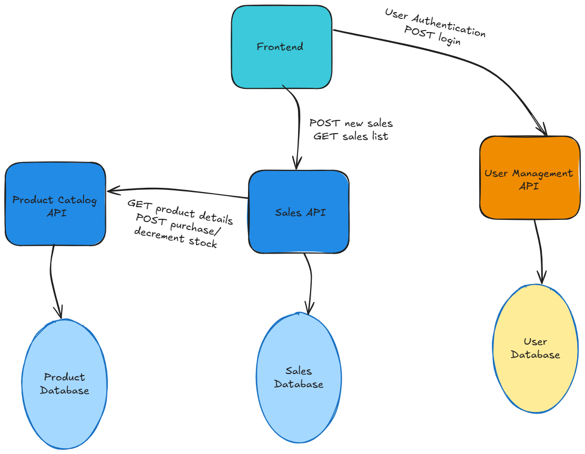

## Overview: Building the Digital Backbone for E-commerce

This prototype showcases a collection of interconnected projects designed to form the backend and a core analytical frontend for a modern e-commerce platform. The goal is to demonstrate proficiency in building robust, scalable, and data-driven web applications by separating concerns into specialized services.

### The Business Scenario: An Online Bookstore's Digital Foundation 📚

Imagine a growing online bookstore that needs a solid digital infrastructure to manage its products, handle user accounts, and track sales performance. This collection of projects addresses these critical needs:

1. **Managing the Book Catalog:** A centralized system to store and organize all available books, their prices, and inventory levels.

2. **Handling User Accounts:** A secure way for customers to register, log in, and manage their profiles.

3. **Tracking Sales & Insights:** A system to record every book sale and provide real-time analytical insights into sales trends and product performance.

These projects collectively form the digital backbone, allowing the online bookstore to operate efficiently, securely, and make data-driven decisions.

## Architectural Overview

Here's a high-level view of how these services interact:

## Individual Projects

Each project in this prototype is a standalone repository, developed with a focus on best practices, clean architecture, and specific functionalities.

### 1. User Management RESTful API (Flask Backend)

* **Repository:** [User Management API GitHub Repo](https://github.com/m-arifin-ilham/User-Management-API)

* **Description:** A secure and scalable backend API for managing user accounts. It features robust user registration, login with JWT access and refresh tokens, role-based authorization, and secure password management. This API serves as the central authentication and user profile service for the entire e-commerce ecosystem, specifically managing **internal users like branch managers and sales representatives** to enable tracking of individual sales contributions.

* **Key Skills:** Python, Flask, RESTful APIs, JWT Authentication, API Security, Layered Architecture, SOLID Principles.

### 2. Product Catalog API (Django Backend)

* **Repository:** [Product Catalog API GitHub Repo](https://github.com/m-arifin-ilham/Product-Catalog-API)

* **Description:** A feature-rich RESTful API built with Django and Django REST Framework (DRF) for managing a comprehensive product catalog. It supports full CRUD operations for products and categories, advanced filtering, dynamic sorting, and basic inventory management (including a custom purchase endpoint). Write operations are secured with API Key authentication, while read operations are publicly accessible. Includes auto-generated Swagger/OpenAPI documentation. This API provides the core product data for the e-commerce platform.

* **Key Skills:** Python, Django, Django REST Framework, ORM, Advanced Filtering & Sorting, API Documentation (drf-yasg), API Key Authentication.

### 3. Simple Sales Tracker (Flask Backend & React Frontend)

* **Frontend Repository:** [Sales Tracker Frontend GitHub Repo](https://github.com/m-arifin-ilham/Sales-Tracker-Frontend)

* **Backend Repository:** [Sales Tracker Backend GitHub Repo](https://github.com/m-arifin-ilham/Sales-Tracker-Backend)

* **Description:** A full-stack web application for recording and visualizing sales data. The Flask backend stores sales records, calculates revenue, and securely integrates with both the User Management API (for user authentication) and the Product Catalog API (for inventory updates). The React frontend provides a user-friendly interface for data input, manages user login/logout, handles JWT tokens, and displays interactive charts with a modern UI.

* **Key Skills:** Python (Flask), React, Full-Stack Development, API Integration, Data Visualization (Recharts), Responsive UI (Tailwind CSS), User Authentication (JWT), Token Refresh Logic, Secure Frontend Development.

## Technologies Across the Portfolio

This portfolio demonstrates versatility across various Python and JavaScript technologies:

* **Backend:** Python (Flask, Django, Django REST Framework, Gunicorn)

* **Frontend:** React, Vite, Tailwind CSS, Axios, Recharts

* **Databases:** SQLite (for local development), PostgreSQL (for deployment consideration)

* **Security:** Bcrypt, JWT, API Key Authentication, Token Refresh Mechanism

* **Development Practices:** RESTful API Design, Layered Architecture, SOLID Principles, Test-Driven Development (TDD), Version Control (Git), CORS Management.

## Getting Started with the Ecosystem

To run this entire ecosystem locally, you would typically:

1. Clone each individual repository.

2. Follow the setup instructions in each repository's `README.md`.

3. Ensure your backend APIs are running (User Management, Product Catalog, Sales Tracker backend).

4. Start your frontend application.

## Future Vision

This portfolio represents a foundational infrastructure. Future enhancements could include:

* Full deployment of all services to a cloud platform (e.g., Render, AWS).

* **Full Customer-Facing E-commerce Storefront:** Implementing a complete shopping cart and checkout process in a **new, dedicated online store frontend**, consuming the Product Catalog API. This would be the public-facing interface where customers browse products, add them to a cart, and complete purchases.

* **User Authentication & Sales Tracking for Customers:** Integration of the User Management API for user-specific sales tracking and authentication in a **new, customer-facing online store frontend**. This would allow individual customers to log in, view their order history, and manage their profiles.

* Adding more advanced analytics and machine learning models for sales forecasting or customer segmentation.

---

*Developed by [Muhammad Arifin Ilham](https://www.linkedin.com/in/arifin-ilham-at-ska/)*

*Current Date: August 9, 2025*